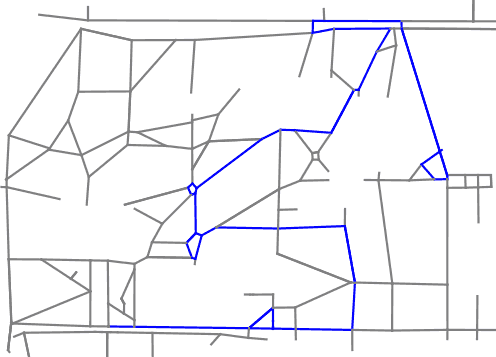

Shortest Path
=============

An exploration of searching graphs for a shortest path

Learning Objectives
-------------------

After completing this lab, students will be able to:

- Implement graph search algorithms in Python
- Describe the costs and benefits of breadth-first, depth-first, Dijkstra's algorithm, and A*

Task
----

Examine the included graph data in [nodes.csv](nodes.csv) and [edges.csv](edges.csv). Handout code is provided to load, process, and display this data in [search.py](search.py)

Implement `search_depth_first`, `search_dijkstra`, `search_breadth_first`, `search_astar` so that all included tests pass.

Tools
-----

The handout code does not produce any graphical output by default, but if you'd like to view particular paths, you can call the `show_path` method to produce a plot using matplotlib. If used correctly, a path should be shown that looks something like this:

Note that latitude and longitude values do correspond to real locations in this data. The node values should match nodes in OpenStreetMap, for example [9585187701](https://www.openstreetmap.org/node/9585187701) is used as the start state in one of the tests. Edges should correspond to walkable paths on campus.

